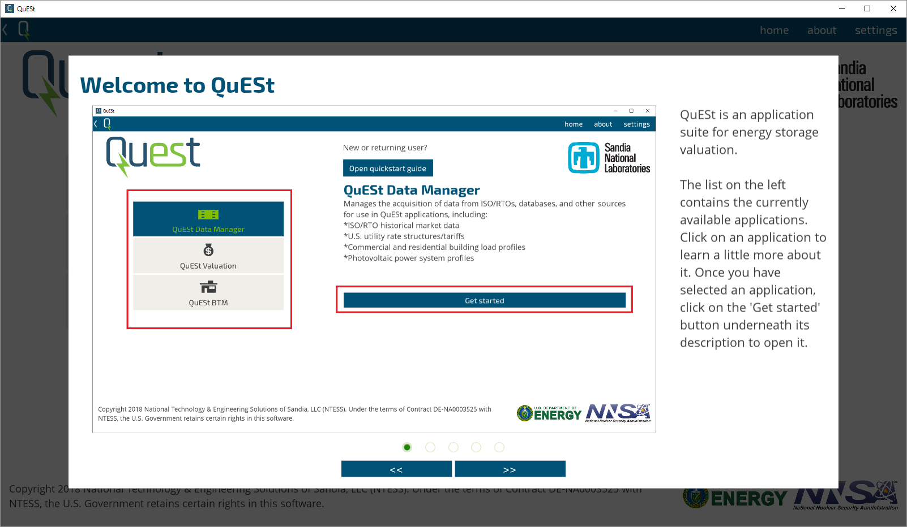
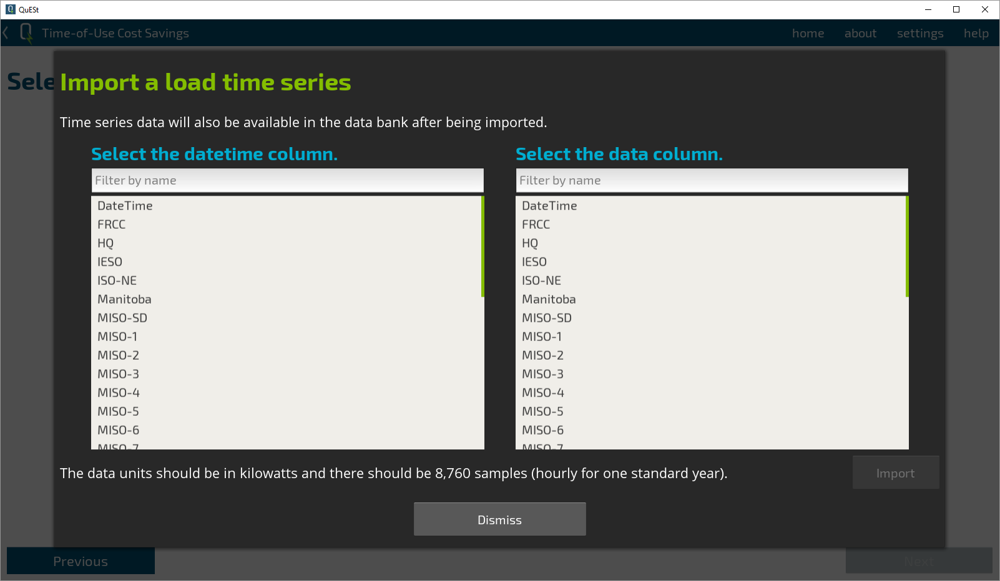
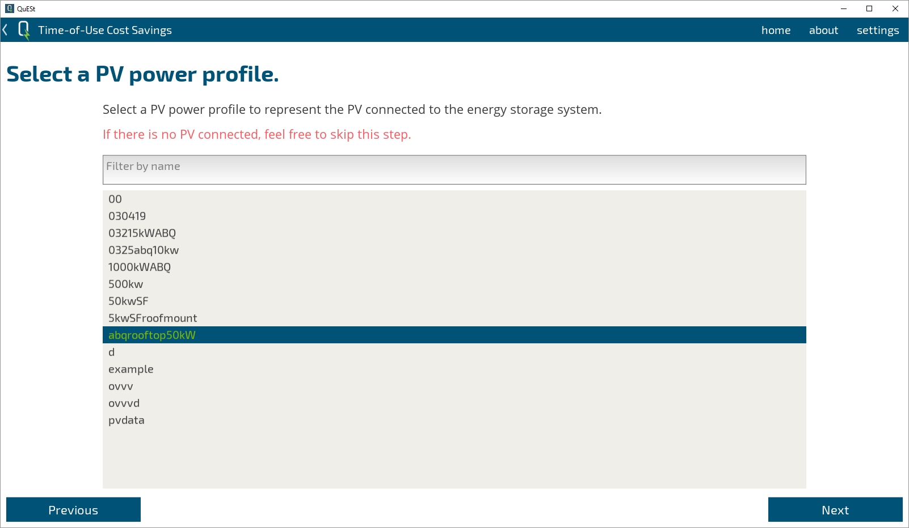
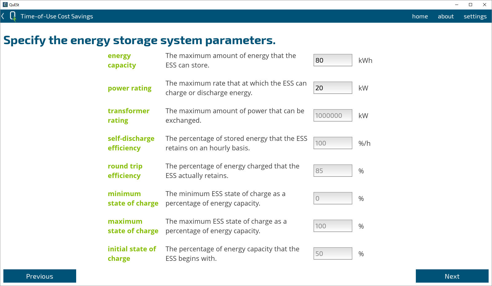

# QuESt Changelog

# Release Notes for QuESt v2.0.b

**Release Date:** August 8, 2024

## Summary

This release includes significant updates, including restructuring the project as a package, cross-platform compatibility, bug fixes related to installations, an update check that is applied when the app is launched, and the introduction of a dark mode theme.

## New Features

### Project Restructured as a Package
- The project has been restructured to follow a more standard Python package layout.
- **Old Structure**:
    ```
    quest/
    ├── main.py
    ├── app/..
    ├── images/..
    ├── snl_libraries/..
    └── ...
    ```
- **New Structure**:
    ```
    snl-quest/
    ├── quest/
    │   ├── __main__.py
    │   ├── app/..
    │   ├── images/..
    │   ├── snl_libraries/..
    │   └── ...
    ├── docs/
    ├── licenses/
    ├── setup.py
    ├── requirements.txt
    ├── LICENSE
    └── .gitignore
    ```
- **Key Changes**:
  - The main entry point has been changed from `main.py` to `__main__.py`.
  - Additional directories such as `docs`, `licenses`, and configuration files like `setup.py`, `requirements.txt`, `LICENSE`, and `.gitignore` have been added to the project root.
  - All imports have been updated to start with `from quest`.
  - QuESt is now run as a module using python -m quest or python3 -m quest.
  - The snl_libraries applications have been restructured in a similar format.
  - The snl_libraries applications are now lighter weight.

### Cross-Platform Compatibility
- QuESt is now fully compatible with Windows, Linux, and macOS.
- Key changes to achieve cross-platform compatibility:
  - Refactored file paths to use platform-independent methods.
  - Updated installation scripts to handle dependencies for different operating systems.
  - Ensured that all external libraries and tools used are cross-platform compatible.
- Users can now run the application seamlessly across different operating systems without any additional configuration.

### Dark Mode
- A new dark mode theme has been introduced to enhance user experience, especially in low-light environments.
  - Users can switch between light and dark modes from the settings menu.

### Automated Updates
- QuESt now checks the github repository for any stable updates that have been pushed.
- This allows for real time bug fixes and app updates to be deployed to all users.

## Improvements

### Installation Process

- Enhanced error messages to provide more informative feedback during installation.
- Added lock files to unix-type systems scripts to prevent multiple installs of GLPK.
- Added shell scripts and updated line endings to be consistent with operating system needs.

## Bug Fixes

### Installation Issues
- Fixed a bug causing app crashes due to incompatible library versions.
- Resolved issues around the installation of GLPK.


## Patch 1.2.g
### Resolved issues
* An issue in Data Manager caused by the update of utility list in OpenEI database.

## Patch 1.2.f
### QuESt
* A quick-start tour is now available from the home index screen of QuESt.
  * 
  * This tour consists of a sequence of slides explaining the general usage of QuESt and is aimed to help new or returning users get oriented.
  * 
* Help carousel modal views (or "help" for short) are now available throughout QuESt. They may be accessed from the top navigation bar whenever available.
  * 
  * Opening the help carousel displays a sequence of slides similar to those from the quick-start tour. The content of the help carousel is relevant to wherever it is accessed. For example, opening the help carousel while in QuESt Data Manager will show help related to that application.
  * 
* Interfaces for users to import custom data have been implemented ("data importer").
  * The data importer is designed to accept time series data in substitution for similar data acquired through QuESt Data Manager.
  * Currently, data importers are available for the QuESt BTM Time-of-Use Cost Savings wizard for load profile and photovoltaic power profile.
  * The data importer is accessible directly within the relevant application when the corresponding data is selected. Instead of selecting from the QuESt data bank, the data importer may be used.
  * 
  * Upon opening the data importer, a series of prompts will appear. The file chooser can be used to select the desired CSV file to use.
    * The drive displayed in the file chooser is based on where QuESt is launched from. Only folders and .csv files will be displayed.
    * 
    * Folders can be expanded by clicking the dropdown arrow to the left of the folder name. Folders can be entered by clicking on the folder name. Clicking the "..\" at the top of the current directory listing will navigate up one directory level.
    * To finalize file selection, double-click on the desired file name or click on the file name and click on the 'Select' button.
    * 
    * Next, the data column must be specified to determine the time series that will be used. The requirements for the data will vary among the different data importers, but generally, for hourly data a time series of length 8,760 (for one standard year) is expected. Please refer to the accompoanying description in the data importer window for specific details.
    * If the selected time series passes validation, the data importer will report a successful import. Upon returning to the current application, the data importer button will change appearance to indicate that time series data was imported and will be used in the current application.
    * 
    * Note that any data imported will be made available for future use in the QuESt data bank. The data may be denoted by an "imported/" tag (in the case of load profile data) and the name will be based on the originating CSV file name and the data column specified during the import process.
    * Selecting from the data bank after import will override the imported data.
    * Opening the data importer and completing the data import process again will override any previous selections or imports.

### Resolved issues
* An issue where Inf or NaN values in data would create infeasible models that could not be solved. Specifically, for PJM data where mileage ratios are computed, division by zero would result in Inf values. QuESt will use a "fill forward" interpolation method to attempt to correct these instances.

### Known issues
* An issue where dragging through slides in help carousels or similar widgets instead of using the arrow navigation buttons does not update the "progress indicator" bubbles for the slides.
  * Clicking the navigation buttons will properly update the bubbles.
* An issue where graphics/charts for HTML reports generated in application wizards would not save and render properly. A blank or incomplete figure would be saved and displayed in the report. We have increased the time for rendering and saving each figure during the report generation process in order to address this issue.

## Patch 1.2.e
### QuESt
* Reports (HTML) generated through wizards such as those in QuESt Valuation and QuESt BTM will now be separated appropriately.
  * Previously: reports were generated in place using the same name if of the same type. For example, if two reports for different wizard runs in QuESt BTMs were generated, the newer one would overwrite the older one because they shared the same name.
  * Previously: figures for reports of the same type would overwrite older figures. For example, a new report generated in QuESt BTM would overwrite the figures of a previous report. However, if the HTML file for the report was not overwritten (e.g., the file name was changed), then the previous report could still be opened. Unfortunately, since the image links in that older report refer to the same path, they would then refer to the newer figures with the same filenames that most likely refer to the incorrect simulation run. An analogous issue occurs in QuESt Valuation. This caused considerable confusion.
  * Now: reports and their figures are saved in separate folders which are timestamped when they are generated. Due to the nature of HTML files, we still encourage users to save the report to a more permanent format (such as PDF) when moving or distributing these reports.
* Errors during optimization solving are now reported more explicitly.
  * Previously: A generic error message would be displayed that would obfuscate underlying causes for errors. For example, an exception from the optimization solver being unable to be found and an exception from mismatched time series data would be reported identically. The user would be unable to know that his or her selected solver was unable to be located or was not installed.
  * Now: Specific errors that are identified are enumerated in the completion popup window. For example, in a batch run with multiple months selected, months for which the data is mismatched are specifically listed.

#### QuESt Valuation
* The formulation for participating in frequency regulation in ISO-NE has been adjusted.
  * The mileage is now estimated using a simulated AGC signal. This signal is automatically downloaded when acquiring data for ISO-NE in QuESt Data Manager.
  * This mileage is used to obtain a mileage multiplier time series for use in performance credit calculations.

### Resolved issues
* An issue where using a search bar to search by state for "VA" would not yield "Virginia".
* An issue where certain error codes returned by the CAISO API would not be handled properly.
* Several typographical errors in reports generated by the QuESt Valuation wizard have been corrected.
* An issue where using CBC as an optimization solver would result in fatal crashes if the mathematical program to be solved was infeasible.

## Patch 1.2.d
### QuESt
* Removed "id" property for NavigationButton(ActionButton) widgets to address deprecation warnings.
* Added files to repository for Travis CI. We will be implementing continuous integration and unit tests over the next few updates.

#### QuESt Data Manager
* PV profiles that are obtained using PVWatts now use the "TMY3" dataset instead of the default "NSRDB" dataset.
  * This is to maintain consistency with the load profiles obtained from OpenEI.org which are based on TMY3.

#### QuESt Valuation
* The "Single Run" mode in QuESt Valuation has been deprecated and removed from the GUI.
  * The functionality of the "Single Run" mode is already duplicated by the "Batch Run" mode.

### Resolved issues
* Various issues due to Kivy v1.11.0 update. Backwards compatibility with Kivy v1.10.1 should be maintained.
* An issue where the settings for the QuESt BTM data management system were not respected.
* An issue where the wrong navigation bar was loaded upon entering QuESt BTM.
* An issue where attempting to start the QuESt Valuation Wizard (on the second screen) or QuESt Valuation Batch Runs (when selecting a market area) after a fresh or install or with no `/data/` directory resulted in a fatal crash.

## Patch 1.2.c
### Resolved issues
* An issue where attempting to download ISO/RTO market data for ERCOT resulted in a fatal crash.

## Patch 1.2.b
### Resolved issues
* An issue where attempting to export a PNG from a results viewer when solved models were selected but no plot had yet been drawn resulted in a fatal crash.

## Patch 1.2
This patch is the official release of QuESt BTM, the application for behind-the-meter energy storage analysis tools. A number of fixes and quality of life improvements for QuESt have also been implemented.

### QuESt
#### QuESt Data Manager
* A tool for downloading utility rate structure data has been implemented.
    * This tool is designed for use in behind-the-meter applications.
    * This tool leverages the [OpenEI](https://openei.org) database through their API.
        * An API key, available through the OpenEI website, is required to use this tool.
    * Search for a utility in the U.S. Utility Rate Database and select a rate structure.
    * 
    * The time-of-use energy and demand rate schedules are retrieved from the database, in addition to the monthly flat demand schedule.
    * 
    * Modify the period rates or rate schedules as desired.
    * Specify the net-metering scheme.
    * Save the rate structure for use in other QuESt applications.
    * 
* A tool for downloading simulated hourly load profiles for commercial and residential buildings has been implemented.
  * This tool is designed for use in behind-the-meter applications.
  * For commercial buildings, search by city to determine the climate and select from one of 17 different commercial building types.
  * 
  * For residential buildings, specify the amount of load from "base", "low", and "high" and select the climate based on location.
  * 
* A tool for downloading simulated photovoltaic power profiles has been implemented.
  * This tool is designed for behind-the-meter applications.
  * This tool leverages the [PVWatts](https://pvwatts.nrel.gov/) software through their API.
    * An API key, the same as the one used for the OpenEI utility rate structure database, is required to use this tool.
  * Specify parameters such as the location of the system in latitude and longitude coordinates, the nameplate capacity, the module and array types, and the system efficiency.
  * 
  * Save the photovoltaic power profile for use in other QuESt applications.

#### QuESt Valuation
* The appearance of the Valuation Wizard has been slightly adjusted.
* Some rudimentary value checking for energy storage system parameters has been implemented.
* The terms for adjusting the allowable range of state of charge have been changed.
  * % of energy capacity to reserve for charging (default: 0) --> maximum state of charge (%) (default: 100)
  * % of energy capacity to reserve for discharging (default: 0) --> minimum state of charge (%) (default: 0)
* The default initial (and final) state of charge has been set to 50% (was: 0).

#### QuESt BTM
* A new application in the QuESt suite, QuESt BTM, has been implemented.
  * This application is designed to have a collection of tools for behind-the-meter energy storage.
* The time-of-use cost savings wizard has been added to QuESt BTM.
  * This tool is for estimating the cost savings provided by energy storage for time-of-use and net-energy-metering customers.
  * Select a utility rate structure and load profile both of which can be obtained using QuESt Data Manager.
  * 
  * 
  * Optionally, select a photovoltaic power profile which can also be obtained using QuEST Data Manager.
  * 
  * Describe the parameters of the energy storage system.
  * 
  * One year of operation will be simulated to minimize cost and the total bill with and without energy storage will be calculated. This includes energy charges, demand charges, and net metering charges and/or credits.
  * 
  * A summary report can be generated at the end of the wizard that includes more detail on the mathematical formulation, a summary of the scenario specified, and a summary of the results including figures.
  * 
  * The results of each individual month can be analyzed further in the results viewer. This includes time series of the adjusted total power draw and the energy storage system's state of charge.
  * 

#### Miscellaneous
* Multiset bar charts generated by, e.g., QuESt Valuation and QuESt BTM wizards, now annotate the maximum value for each set.
  
* The "solved model" list in results viewer tools now lists the models in reverse chronological order.
  

### Resolved issues
* An issue where versions of the Pyomo (~5.6) package would cause QuESt to crash to desktop when trying to solve optimization models.
* An issue where non-numeric characters could not be entered into the "NodeID" field in the ISO/RTO market and operations data tool in QuESt Data Manager. Previously, this prevented you from entering in Node ID values with alphanumeric characters and downloading the corresponding data.

### Known issues
* An issue where a blank image instead of the expected chart appears when generating a report from the QuESt Valuation wizard or QuESt BTM Time-of-Use Cost Savings wizard.
  * If this issue persists, we may consider using alternative means to generate the charts external to the GUI. Generating the report again may solve the issue.
* An issue where search filters, such as those in selection lists or in the utility rate structure tool in QuESt Data Manager, are too sensitive to queries.
  * We plan on implementing "fuzzy" search or similar concepts to ease the use of these search tools and filters.
* An issue where QuESt will be reported as "not responding" by the operating system during batch optimization processes such as those in the QuESt Valuation and QuESt BTM applications.
  * This is due to the processing requirements of solving the models preventing the GUI from being updated. We will consider restructuring how the computation is performed in order to minimize GUI freezes.

## Patch 1.1
This patch provides a number of content and quality of life updates for QuESt Data Manager and QuESt Valuation.

### QuESt
#### QuESt Data Manager
* Market and operations data for ISO-NE, NYISO, CAISO, and SPP market areas are now available.
* Added buttons that cancel the current data download requests.
    * The download/cancel buttons are independent for each tab.

#### QuESt Valuation
* (Arbitrage) and regulation market models for ISO-NE, NYISO, CAISO, and SPP are now available for use in all QuESt Valuation modes.

### Resolved issues
* An issue where QuESt Valuation would say that you have no data downloaded even if you do and prevent you from proceeding.
* An issue where certain choices in QuESt Valuation wizard would cause the application to force quit upon attempting to solve.
* An issue where data scanning at QuESt Valuation startup would take an inconvenient amount of time to complete.
* An issue where newer versions of `matplotlib` (3.x) were incompatible, resulting in application crash at launch.
* An issue where background threads would persist until completion even when QuESt was closed.

### Known issues
* An issue where older versions of `pandas` were incompatible, resulting in application crash during certain operations. A package version number has now been specified in the setup file. Please either rerun the `setup.py install` or manually update your `pandas` package.
* An issue where certain pricing node options in the SPP market area will not have LMP data for certain time periods, despite having the option to select it in QuESt Valuation menus. This is due to having a static list of pricing nodes for SPP. Previously, this would cause a full application crash if none of the selected months for valuation were solvable.

## Release 1.0
The official release version of QuESt.

### QuESt
#### QuESt Data Manager
An application for downloading data from RTO/ISO/market operators for use in other QuESt applications.

* Market and operations data for the following RTOs/ISOs are available using the download utility:
    * ERCOT
    * MISO
    * PJM

#### QuESt Valuation
An application for performing energy storage valuation. Using historical data from market area operators, set up and solve optimization problems to estimate an upper bound on the revenue that a energy storage device could have generated over the horizon of the data.

* Features
    * Wizard: a streamlined, guided interface for setting up sets of valuation runs
        * Pick a market area, pricing node, energy storage device, and historical dataset
        * Perform a valuation for the device each month in the set
        * Generate a pro forma report to summarize the findings in a convenient document
    * Single Run: a more flexible interface for setting up valuation runs for one month at a time
        * Offers more customization in terms of energy storage device and simulation parameters than the wizard
    * Batch Runs: an even more flexible interface for setting up large sets of valuation runs
        * Expands upon the wizard, allowing for the selection of multiple months for valuation
        * Perform parameter sweeps to look at the sensitivity of certain device or market parameters
    * Results viewer: a convenient tool for quickly checking your valuation results
        * Plot time series of revenue, state of charge, or scheduled charging/discharging actions
        * View the statistics of electricity prices for each month
        * Export .csv files for external viewing or processing

### Known issues
* An issue where the solver does not exit successfully for certain optimization problems.
* An issue where certain downloaded data may not appear as options for use in QuESt Valuation.
* An issue where results for MISO valuations have constant objective functions leading to trivial optimization problems are obtained when they should be excluded.

## Patch 2018.07.24
Merged WIP of Data Manager.

### QuESt
#### General
* Due to data downloader issues, ISO-NE support will be considered experimental at this time. It will likely be removed from the release version.

#### QuESt Data Manager
* ISO/RTO data downloader general interface has been implemented.
* Temporarily, data will be downloaded to a separate `./data/` directory (rather than `./data_bank/`) for testing and development. Therefore, it will not impact data saved in the old data_bank or operation of the Valuation application.
* ERCOT data downloader has been implemented.
* ISO-NE data downloader has been generally implemented. However, due to connection issues with the API, it is not considered complete.

#### QuESt Valuation
* "Pro forma" report generation from the wizard has been implemented.

### Resolved issues
* An issue where simulations with PJM models would crash the program.
* An issue where exporting to CSV from the results viewer would crash the program.

### Known issues
* ISO-NE API

## Patch 2018.06.22

### QuESt
#### General
* Implemented font and color changes according to graphics design update.
* Added copyright notice to landing screen.

### Resolved issues
* An issue where values set for `fraction_reg_up` and `fraction_reg_down` after ValuationOptimizer object instantiation were being ignored and defaults were being used.

## Patch 2018.06.13

The selected name and tagline QuESt: Optimizing Energy Storage has been implemented. This patch addresses much of the feedback received during R1 of usability testing.

### Valuation Optimizer
* Added check for self-discharge/conversion efficiencies: If value > 1.0, it is interpreted as percentage. Equalities/inequalities still use unit of fractions.
* Added electricity prices to results dataframe.
* Added bad parameter checking.
* Renamed `S_max` to `Energy_capacity`.
* Removed `S_min` in favor of `Reserve_charge_min` (in terms of fraction of energy capacity).
* Renamed `Storage_efficiency` to `Self_discharge_efficiency`.
* Renamed `Conversion_efficiency` to `Round_trip_efficiency`.

### QuESt
#### Codebase
* `main.py` has been moved to the repository root.
* Directory references like `\x\y\z.file` have been changed to `os.path.join(x, y, z.file)` when possible. (.py files)

#### General
* "Select market formulation" has been changed to "Select revenue streams".
* The default and minimum window size has been increased to 1600x900.
* Font sizes have been increased.
* The appearance of spinners/dropdowns have been adjusted to be more recognizable.
* The color, width, and activity behavior of the scroll bar in scroll views have been adjusted for visibility.
* Keyboard shortcuts partially implemented. Enter or NumpadEnter keys can now be used to close most warning popups (typically popups with only a single button for closing them).
* The keyboard shortcut for exiting the application (Esc) has been disabled.
* Efficiencies have been given display units of (%/h) and value ranges have been adjusted accordingly.
* Maximum state of charge has been renamed to "energy capacity (MWh)."
* Added select-all behavior when tabbing among text input fields.

#### Landing screen
* The "About", "Settings", and "Help" buttons on the landing screen have been moved to the top navigation bar.
    * They will remain consistently at the beginning of the navigation button sequence.
    * The "Quit" button has been removed.
* The landing screen layout has been slightly adjusted to increase the call to action for proceeding.

#### Settings
* The "Settings" screen has been converted to a modal view with a sidebar menu interface.
    * It is now accessible from any screen.

#### Single Run
* The parameter entry widget has been changed to a three column grid layout to match the batch runs tool.
* The "run optimization" popup text has been adjusted.
* Interface when completing runs matches that of batch run.
* The node selector interface has been adjusted.

#### Batch Runs
* The look and feel has been adjusted to facilitate the logical order of progression.
    * The month/data and pricing node selection RV's have their alpha values set to 0.05 until both a market area and revenue streams are selected.
        * Changing the market area will reset the alpha values back and reset the revenue stream selection.
* The parameter sweep selection spinner now displays "Select a parameter to sweep" by default.
* A warning now appears if you try to run a batch when anything in the parameter sweep range text input fields is entered but no parameter is specified.
* Upon completion of a batch, a button can take you to the results viewer.

#### Results Viewer
* "View Results" has been renamed to "Results Viewer"
* The "Results Viewer" screen has been redesigned.
    * No axes are displayed until a plot is actually drawn.
    * The toolbar has been condensed.
    * The run selector has been implemented directly into the results viewer interface.
        * The run names contain most information about the specific run, including all parameters set differently from defaults.
        * The hover behavior has been removed.
    * The time selector has been implemented directly into the results viewer interface.
        * Pressing Enter/NumpadEnter after entering into the text inputs now automatically calls Plot/Redraw.
* The plot figure layout has been adjusted.
    * The legend has been moved to outside the plot.
    * In accordance with the run name adjustments, the legend label now displays more information.
        * With the potential of extremely long legend labels, the amount of simultaneous traces that can be comfortably displayed may be affected.
    * All plots have been changed to "stair"/"step" plots.
    * Major grid lines have been implemented.
    * x-axis labels have been changed to "ending hour."
* Additional spacing between legend entries has been added.
* A "Deselect all" button has been added for the run selector.
* Leaving the results viewer completely resets it, including removing the active plot, deselecting any run selections, and reverting time selectors to defaults.
* Added plot options for electricity prices (line and box plots).

#### Wizard
* The sequence of screens has been adjusted.
    * ISO select, rev. stream select, device select, data select, node select -> ISO select, node select, rev. stream select, data select, node select
* The minimum state of charge (MWh) parameter setter has been removed.
* Filter by node name text input has been implemented.
* Node ID and name description has been removed.

#### Report
* The names of reports have been adjusted.
    * Activity (by source) -> Participation (by month)
    * Activity (%, total) -> Participation (total)
    * Report titles and text have been adjusted accordingly.
    * The activity stacked bar chart (non-normalized) has been removed.
* Certain additional words have been bolded in report text.

### Resolved Issues

### Known Issues

## Patch 2018.05.09

### Resolved issues
* An issue where ISO-NE simulations would not properly handle an exception due to an exception class not available in Python 2.x, leading to an UnboundLocalError.

## Patch 2018.05.07

### Systems

#### Software tool
* The summary of selections screen for the valuation wizard has been implemented.

### Resolved issues
* An issue where an ImportError would occur for op_handler when the application was executed outside of an IDE project.

## Patch 2018.05.04

This patch brings an extensive visual design overhaul and a number of redesigned features.

### Systems

#### Valuation Optimizer
* A single "power rating (Q_max)" has been implemented to replace max charge/discharge ratings (Q_r_max and Q_d_max, respectively).
    * Constraints have been replaced accordingly.
* Reserve_charge and Reserve_reg parameters have been split into scalar parameters.
    * Reserve_charge_min, Reserve_charge_max, Reserve_reg_min, Reserver_reg_max

#### Data
* The node list for ISO-NE has been reduced to 8 "zones."
* April 2015-November 2017 have been added as options for ISO-NE.
* PJM for H2 2017 has been added. Options for it in the GUI have been added as well.
* PJM and MISO price node selection has been reduced.

#### Software tool
* Compatibility for Python versions prior to 3.0 will no longer be checked.
* New fonts and palette implemented. Subject to change as software branding is developed.
* Animations and transitions have been generally sped up.
* Numerous "content definitions" that were previously hard-coded have been factored out into definition .json files (/es_gui/apps/valuation/definition/). This is aimed at centralizing content changes; e.g., if new sets of historical data are added, we can update all the UI changes by adjusting these definitions, rather than changing hardcoded values in numerous files.

* The landing/index screen has been redesigned.
* The help link has been removed, pending an overhaul.
* The about screen has been redesigned into a popup.
* The welcome splash screen has been removed.
* The settings panel has been updated.
    * Removed setting regarding welcome splash screen.
    * Added category headers.
    * Added settings regarding the Valuation data cache.

* ValuationDMS object persistence has been implemented. This allows for the preservation of the ValuationDMS's loaded data, even when the software tool has been closed and reopened. The maximum size of the persisting object, as well as the feature as a whole, can be adjusted in the settings panel.

NOTE: This object is stored as a pickle (/es_gui/valuation_dms.p) and is not compatible between Python versions. If you encounter errors upon software initialization regarding inability to read the pickle, delete the file.

* Several visual design adjustments to the Valuation Wizard have been made.
* Selection of "revenue streams" has become selection of "market formulation."

* A "ValuationOptimizationHandler" class has been implemented. This class consolidates a lot of behavior that was spread across numerous objects. Its function is to receive sets of instructions and interpret them to load the appropriate data and create and solve the ValOptimizer models as requested. It also handles access to solved models.
    * Essentially, other objects just need to generate the instructions and send it to the ValOpHandler. It's the ValOpHandler's responsibility to handle interactions with the DMS and ValOptimizer instances. This is also aimed at centralizing content-specific changes; e.g., if a new market type is implemented in ValOptimizer, only the ValOpHandler needs to know how to use it.

* The Batch Runs screen has been redesigned.
    * Market-specific "static" parameter input fields have been implemented.

* The View Results screen has been adjusted.
    * Selecting a data type to display no longer automatically redraws the plot.
    * Closing the "time selector" popup no longer automatically redraws the plot.
    * "Plot/Redraw" must be pressed to update the graph.

* The Load Data screen has been adjusted.
    * Arrow buttons have been added.
    * Loading data is no longer actually handled on this screen.
    * It has been renamed "Select Data" in the GUI to reflect these changes.

* The Set Parameters screen has been redesigned.
    * The parameters displayed dynamically change when entering the screen, based on the market area selected in the Load Data screen.
    * No button required to explicitly set values.

* The flow of the single month valuation run has been adjusted.
    * The valuation run that is performed is based on whatever is displayed in the UI upon execution. The UI does not reset after execution.
    * Due to back end changes, background threading of certain tasks has been removed.

* The menu structure of the Energy Storage Valuation application has been adjusted.
    * The landing screen presents three options for simulation: Wizard, Single Run, and Batch Runs. It presents one option for analysis: View Results.
    * Batch Runs and Wizard lead directly to their interfaces.
    * Single Run leads directly to Select Data and only links to Set Parameters and View Results.

### Resolved issues
* An issue where the run selector on the View Results screen would fail to identify that runs have been selected for viewing.
* An issue where the description text for the activity donut report chart would not be fully displayed.

## Patch 2018.04.06

NOTE: If you experience import errors, try clearing your compiled Python files (*.pyc). In PyCharm, you can do this by right-clicking the top level directory in the project viewer and clicking "Clean Python Compiled Files."

### Systems

* Relative imports for package modules have been reimplemented.
* Fixes for compatibility with Python 3.4 have been implemented.
    * RC: I cannot get Kivy to run in Python 3.6 on OSX...

### Resolved issues
* An issue where get_node_name() under ValuationDMS would return None, causing the app to crash when loading the node list in Wizard in Python 3.x.
* An issue where loading certain charts in the Wizard would cause the app to crash due to dictionary changes in Python 3.x.
* An issue where the app would fail to initialize due to a non-Python 3.x-compliant print() statement in the hoverable module.

### Known issues
* An issue where LMP data for MISO nodes in the node list is not available.
* An issue where the wizard execute screen says it is finished when it is not.

## Patch 2018.04.05

NOTE: If you experience import errors, try clearing your compiled Python files (*.pyc). In PyCharm, you can do this by right-clicking the top level directory in the project viewer and clicking "Clean Python Compiled Files."

### Systems

#### Optimizer
The class formerly known as Optimizer has been redesigned for future extensibility. The focus was on minimal interface design, encapsulation, and designing for inheritance.

* Factored out an abstract base class (ABC) "Optimizer"; this ABC is intended to serve as a template class to inherit from when creating future Pyomo model frameworks. This ABC lives in `/es_gui/tools/optimizer.py`.
* Renamed the class formerly known as Optimizer to "ValuationOptimizer." It resides in `/es_gui/tools/valuation/valuation_optimizer.py`
* Created test class for ValuationOptimizer. You can run a test by running `valuation_optimizer.py`. It runs a couple of optimizations and gives you a value to check the result against.
* The market_type 'arbreg' has been renamed 'ercot_arbreg'.
* The var, param, and validate_attr modules have been encapsulated into the ValuationOptimizer class.
* The public interface of the class has been streamlined according to minimal interface design. Parameters have been named/renamed as follows:
    * lmp --> price_electricity
    * ru --> price_reg_up
    * rd --> price_reg_down
    * regCCP --> price_reg_capacity
    * regPCP --> price_reg_performance
    * cost_charge (NEW)
    * cost_discharge (NEW)
    * regA_mi --> mileage_slow
    * regD_mi --> mileage_fast
    * mi_ratio --> mileage_ratio
    * gamma_ru --> fraction_reg_up
    * gamma_rd --> fraction_reg_down
    * Gamma_s --> Storage_efficiency
    * Gamma_c --> Conversion_efficiency
    * Reserve_reg (NEW)
    * Reserve_charge (NEW)
    * Make_whole (NEW)
    * time_interval --> time

* Names were selected to be generic and minimize conflation with market-specific terminology.
* Regulation prices are matched to the appropriate interface. For example, PJM's RMCCP is matched to price_reg_capacity. MISO's RegMCP is matched to price_reg_performance. (RC: I picked this because it's the only reg. price and it's multiplied by Perf_score in the revenue calculation.)
* The matching of Val.Opt. interface parameters to Pyomo model attributes is done in the instantiate_model class method.
* At the moment, the actual parameter names used in the Pyomo expressions are largely unchanged. These are implementation details that can be changed at any time.
* Greek letter names have been removed from the code. These symbols should be used for documentation/publications as necessary.
* Cost of charging/discharging parameters have been declared, but not yet implemented.
* Reserve_reg and Reserve_charge parameters have been implemented. These adjust the state of charge limits at each time step. Reserve_reg is defined in terms of fractions of the regulation bid at the current time step. Reserve_charge is defined in terms of fractions of S_max. These parameters are provided as length-2 array-likes (tuple, list, ...). From the IEEE Access article, Reserve_reg is roughly equivalent to ($`a_0`$, $`b_0`$) and Reserve_charge is roughly equivalent to ($`a_1`$, $`b_1`$).
* `block.py` and `constraints_optimizer.py` have been rolled into `constraints.py`. The functionality of block was rolled into a class "ExpressionsBlock," an object that interacts with the Val.Opt. object. The constraint and objective functions are functions in the `constraints.py` module.
* Console output from the Pyomo solver has been eliminated.
* Logging functionality has been introduced to Val.Opt.

#### ValuationDMS
* Logging functionality has been introduced to Val.Opt.

#### App
* Integrated Val.Opt. changes.
* Removed placeholder accordion items from Index.
* Changed About screen to a modal view and changed its content.
* Removed "Quick Demo" button from the Valuation - Advanced screen.
* Adjusted size_hint_x values in View Results screen to reduce clipping.
* Added two more energy storage device templates to the Wizard.
* The ValuationDMS has been moved to be a property of the Valuation - Home screen.

### Resolved issues
* An issue where "regulation capacity offered" was incorrectly calculated as "reg_up - reg_down" in ERCOT arbreg plots in the View Results screen.
* An issue where a blank field in "Select time" in "View Results" screen can be entered, causing the app to crash.
* An issue where View Screen's toolbar would remain disabled after selecting runs to view.

### Known issues
* An issue where LMP data for MISO nodes in the node list is not available.
* An issue where the wizard execute screen says it is finished when it is not.

## Patch 2018.03.29

### Systems

#### Optimizer
* Overloaded gamma_ru and gamma_rd to accept single value or arrays.
    * If single value, it is constant over entire time horizon.
    * If no value is provided, a default is used (defined in param.py).
* Added iso_ne_pfp market_type.
* Removed redundant constraint definitions (state of charge min/max).
* Added results and net_revenue properties. results gives you a DataFrame representation of the solution. net_revenue gives you the objective function value.

#### ValuationDMS
* Reworked ERCOT to use datafiles from their website ("historical").
* Transitioning out of nested dictionary setup of DMS. Will use a single key that can be parsed for utility function arguments.

#### Data
* Added ERCOT data from 2013-2017. Replaced the 2011 data.
* Added ISONE zonal data for 2013-2017.

#### App
* Integrated ISO-NE into advanced, wizard, and report sections.
* Updated for new ERCOT data.
* Changed ISO select buttons to be in a grid layout to fix their dimensions.

### Resolved issues
* An issue where MISO data in 12/2014 was incomplete or corrupted.

### Known issues
* An issue where LMP data for MISO nodes in the node list is not available.
* An issue where the wizard execute screen says it is finished when it is not.