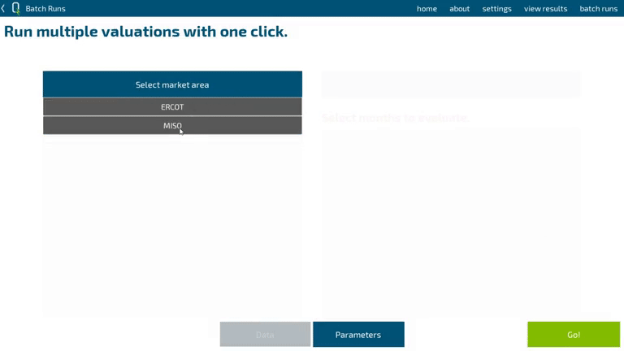

# QuESt: Optimizing Energy Storage
[](https://travis-ci.com/rconcep/snl-quest)

Current release version: 1.6

Release date: April, 2022

## Contact
For issues and feedback we would appreciate it if you could use the "Issues" feature of this repository. This helps others join the discussion and helps us keep track of and document issues.

### Email
Entity account `@sandia.gov: snl-quest`

Project maintainer (Tu Nguyen) `@sandia.gov: tunguy`

## Table of contents
- [Introduction](#intro)
- [Getting started](#getting-started)
- [Frequently Asked Questions](#faq)
    - [QuESt Data Manager](#faq-data-manager)
    - [QuESt Valuation](#faq-valuation)
    - [QuESt BTM](#faq-btm)

### What is it?
<a id="intro"></a>
QuESt is an open source, Python-based application suite for energy storage simulation and analysis developed by the Energy Storage Systems program at Sandia National Laboratories, Albuquerque, NM. It is designed to give users access to models and analysis for energy storage used and developed by Sandia National Laboratories. It's designed to be transparent and easy to use without having to have knowledge of the mathematics behind the models or knowing how to develop code in Python. At the same time, because it is open source, users may modify it to suit their needs should they desire to. We will continue developing QuESt and its applications to enable more functionality.

#### QuESt Data Manager
An application for acquiring data from open sources. Data selected for download is acquired in a format and structure compatible with other QuESt applications. Data that can be acquired includes:
* Independent system operators (ISOs) and regional transmission organization (RTOs) market and operations data
* U.S. utility rate structures (tariffs)
* Commercial or residential building load profiles
* Photovoltaic (PV) power profiles

*Note: An internet connection is required to download data.*

*Note: Certain data sources require registering an account to obtain access.*


#### QuESt Valuation
An application for energy storage valuation, an analysis where the maximum revenue of a hypothetical energy storage device is estimated using historical market data. This is done by determining the sequence of state of charge management actions that optimize revenue generation, assuming perfect foresight of the historical data. QuESt Valuation is aimed at optimizing value stacking for ISO/RTO services such as energy arbitrage and frequency regulation.




#### QuESt BTM
An application for behind-the-meter energy storage system analysis. Tools include:
* Cost savings for time-of-use and net-energy-metering customers


#### QuESt Performance
An application for analyzing battery energy storage system performance due to parasitic heating, ventilation, and air conditioning loads. This tool leverages the building simulation tool EnergyPlus to model the energy consumption of a particular battery housing.


#### QuESt Technology Selection

An application for identifying the energy storage technologies most suitable for a given project. This tool is based on multiple parameters that characterize each storage technology; the technologies that do not satisfy the minimum application requirements are filtered out and the remaining technologies are ranked to indicate their compatibility to the desired project.


### Who should use it?
The software is designed to be used by anyone with an interest in performing analysis of energy storage or its applications without having to create their own models or write their own code. It’s designed to be easy to use out of the box but also modifiable by the savvy user if they so choose. The software is intended to be used as a platform for running simulations, obtaining results, and using the information to inform planning decisions. 

## Getting started
<a id="getting-started"></a>

### Installing from executable (recommended)
Running QuESt from an executable is the most straightforward way to get started with QuESt. You do not require any Python installation to install QuESt with this method; simply run the executable. What is required:

* QuESt executable package
* Solver compatible with Pyomo

We are currently looking into packaging a basic solver to simplify the installation process further.

#### Windows 10
You can find the executable version with each release in the [**Releases**](https://github.com/rconcep/snl-quest/releases) section.

1. Download and extract the `.zip` that is *not* labeled "Source code." Its name will be `snl-quest-v{version number}-win10.zip`.
2. Inside the extracted folder, there will be a lot of files and folders. Locate the `snl-quest-v{version number}.exe` file and run it.
3. A command prompt should open along with the QuESt GUI.

#### OSX, Linux
Currently, we do not offer executable packages of QuESt for OSX or Linux operating systems. They are possible to package but we have not implemented those packaging processes yet. Installing from source code is an option.

#### Solvers
When running the executable version of QuESt, a solver compatible for Pyomo is still required to be installed and on your system path. Please refer to the [solvers](#install-solvers) section for details.

### Installing from source code (advanced)
For all platforms, you can instead install QuESt using the codebase in this repository.

You will want to obtain the codebase for QuESt. You can do that by downloading a release version in a compressed archive from the "releases" tab on the GitHub repository page labeled as "Source code". Alternatively, you can clone this repository or download a compressed archive of it by clicking the "Clone or download" button on this page. We recommend keeping the QuESt files in a location where you have read/write permission. Once you have the codebase, follow the appropriate set of instructions for your operating system.

**Requirements**
* Python 3.6+
* Kivy 1.10.1+ and its dependencies
* Solver compatible with Pyomo

#### Windows

#### Method 1 (With Anaconda)(Recommended)

1. Install Python via [Anaconda](https://www.anaconda.com/download/). Use the 64 or 32-Bit Graphical installer as appropriate.
2. Add the following three locations to your `path` variable: `/path/to/Anaconda3`, `/path/to/Anaconda3/Scripts`, `/path/to/Anaconda3/Library/bin`
3. Open Anaconda Prompt. Create a new conda environment: `conda create --name quest python=3.9`. Activate this environment: `conda activate quest`. 
4. Install Kivy: `pip install kivy` or `conda install kivy`. More information on Kivy can be found [here](https://kivy.org/docs/installation/installation-windows.html).
5. Navigate to the root directory of the codebase (where the `main.py` file is)": `cd /path/to/snl-quest`. Then run the setup file using
 ``python setup.py develop`` This will check dependencies for QuESt and install them as needed.
4. Install a solver for Pyomo to use. See other sections for instructions on this.

#### Method 2 (Without Anaconda)

1. Install Python from [here](https://www.python.org/downloads/).
2. Add the path to the Python executable to your `path` variable.
3. Open Windows command prompt.
4. Install Kivy: `pip install kivy`. Remember that `conda install kivy` will not work here since we are not using Anaconda Prompt in this method. 
5. Follow steps 5 and 6 from Method 1. 
  
#### OSX
1. Install Python, preferably via scientific distribution such as [Anaconda](https://www.anaconda.com/download/). Use the 64 or 32-Bit Graphical installer as appropriate.
2. Install Kivy. Check [here](https://kivy.org/doc/stable/installation/installation-osx.html#using-homebrew-with-pip) for the latest instructions. (Refer to "Using Homebrew with pip" OR "Using MacPorts with pip")
3. Navigate to the root directory of the codebase. Then run the setup
 ``python setup.py develop`` This will check dependencies for QuESt and install them as needed.
4. Install a solver for Pyomo to use. See other sections for instructions on this.

### Solvers for Pyomo
<a id="install-solvers"></a>
At least one solver compatible with Pyomo is required to solve optimization problems. Currently, a solver capable of solving linear programs is required. GLPK and CBC are suggested options for freely available solvers. Note that this list is not meant to be exhaustive but contains the most common viable options that we have tested. 

#### Installing GLPK (for Windows)
1. Download and extract the executables for Windows linked [here](http://winglpk.sourceforge.net/).
2. The glpk_*.dll and glpsol.exe files are in the `w32` and `w64` subdirectories for 32-Bit and 64-Bit Windows, respectively. Select the pair for the appropriate version of Windows that you are using. You can place them in the same directory as the QuESt executable. 
   * Alternatively, you can place those files to the `C:\windows\system32` directory in order to have them in your system path. This will make GLPK available for the rest of your system instead of just for QuESt.
   * (When placing the files in your system path) Try running the command ``glpsol`` in the command prompt (Windows) or terminal (OSX). If you receive a message other than something like "command not found," it means the solver is successfully installed.

#### Installing GLPK (for Windows via Anaconda)
If you've installed Python using Anaconda, you may be able to install several solvers through Anaconda's package manager with the following (according to Pyomo's [installation instructions](https://pyomo.readthedocs.io/en/latest/installation.html)):

``conda install -c conda-forge glpk``

#### Installing GLPK (for OSX)
You will need to either build GLPK from source or install it using the [homebrew](https://brew.sh/) package manager. This [blog post](http://arnab-deka.com/posts/2010/02/installing-glpk-on-a-mac/) may be useful.

#### Installing GLPK or CBC (for OSX via Anaconda)
If you've installed Python using Anaconda, you may be able to install several solvers through Anaconda's package manager with the following (according to Pyomo's [installation instructions](https://pyomo.readthedocs.io/en/latest/installation.html)):

``conda install -c conda-forge glpk``

``conda install -c conda-forge coincbc``

#### Installing IPOPT (for Windows)
1. Download and extract the pre-compiled binaries linked [here](https://www.coin-or.org/download/binary/Ipopt/). Select the latest version appropriate for your system and OS.
2. Add the directory with the `ipopt.exe` executable file to your path system environment variable. For example, if you extracted the archive to `C:\ipopt`, then `C:\ipopt\bin` must be added to your path.
3. Try running the command ``ipopt`` in the command prompt (Windows) or terminal (OSX). If you receive a message other than something like "command not found," it means the solver is successfully installed.
Regardless of which solver(s) you install, remember to specify which of them to use in Settings within QuESt.

### Running QuESt
If you are using the executable version, simply run the `snl-quest-v{version number}.exe` file.

If you are running from the codebase, from the Anaconda Prompt or Command Prompt, run:
```
python main.py
```

Alternatively, run ```main.py``` in a Python IDE of your choice.

**NOTE: The current working directory must be where ``main.py`` is located (the root of the repository).**

### Updating QuESt
#### Installed from executable
Download and extract the executable package as previously. You can copy over your `\data\` directory to transfer your data bank to the new version. You can also copy over your `\quest.ini` file to migrate your QuESt settings as well.

#### Installed from source code
If you cloned the GitHub repository, you can execute a `git pull` command in the terminal/cmd while in the root of the QuESt directory. If you haven't modified any source code, there should be no conflicts. The master branch of the repository is reserved for release versions and is the most stable.

If you downloaded an archive of the master branch, you can download the latest release version as if it were a fresh install. You can drag and drop your old data directory so that you do not have to download all the data again if you would like. You can also move your `/quest.ini` file to migrate your settings.

## Frequently Asked Questions
<a id="faq"></a>

### General

> I am getting import errors when trying to run QuESt.

The current working directory must be where ``main.py`` is located.

> The appearance of GUI elements in QuESt do not appear correct/The window does not display properly/The window is too big for my display/I cannot click or interact with the UI properly.

QuESt is designed to be displayed at minimum resolution of 1600x900.

There are a number of possible reasons for display issues, but the most likely reason is due to operating system scaling. For example, Windows 10 has a feature that scales the appearance of display elements, usually to assist with higher resolution displays. For example, if scaling is set to 125% in Windows, this will scale the QuESt window to be too big for the display (on a 1920x1080 resolution display).

Scaling may also have the effect of confusing Kivy of where a UI element is and where it is displayed; e.g., you may be clicking where a button appears to be, but the scaling causes Kivy to not "detect" that you are pressing the button.

So far, this issue has been observed on a variety of laptops of both Windows and OSX varieties. Our suggestion is to disable OS level scaling or to connect to an external display and try to launch QuESt on it.

> Are there any help tutorials/manuals/etc. for QuESt?

We strive to make QuESt as lightweight and intuitive to use as possible through its design. In version 1.2.f, we integrated additional help carousels within QuESt to provide additional details throughout the software. We currently do not intend to make a comprehensive manual but may share presentation materials such as mini tutorials that may be of interest.

> I want to know more about how the algorithms work/how the results are computed.

Please see the [references](#references) for relevant publications describing the models that were implemented into QuESt. As we further develop the API and documentation, we will aggregate formulation details in those documents.

> I'm interested in a tool/capability that is not currently in QuESt.

Feel free to drop us a line! User feedback helps shape our development goals and priorities and we would welcome hearing what users would like to have.

### QuESt Data Manager
<a id="faq-data-manager"></a>

> I am connecting to the internet through a proxy, such as on a corporate network. How should I configure my connection settings?

Typically, devices have their connection settings configured for the network they will primarily residing on. For example, proxy settings may already be configured in system environment variables and whatnot. We recommend that your proxy settings be configured at the operating system level and that you do not additionally specify using a proxy in QuESt settings. In our experience, additionally specifying the same proxy settings in QuESt "does no harm," but your mileage may vary.

> I am trying to download data and am receiving many messages about connection errors, timeouts, etc. What should I do?

We found these issues to be very network dependent and hard to diagnose or mitigate against. The best practice would be to limit the amount of data that you request at a time. Additionally, QuESt Data Manager is configured to skip data that is already downloaded so you can just issue the same request to patch up any data that may have failed to download.

> I downloaded data but other QuESt applications are telling me that I haven't downloaded any.

QuESt expects data to be in a certain directory structure as structured by QuESt Data Manager. Changing directory names, filenames, modifying files, etc. will produce unexpected results. We recommend not performing any modifications to downloaded data files except for perhaps deleting them.

> How do I obtain PJM Data Miner 2 API access?

Refer to the instructions in QuESt Data Manager or see the API guide [here](http://www.pjm.com/markets-and-operations/etools/data-miner-2.aspx).

> How do I obtain an ISO-NE ISO Express account?

Refer to the instructions in QuESt Data Manager or simply register an account at ISO-NE's [website](https://www.iso-ne.com/). Make sure to sign up for Data Feeds access.

> Why can't I download [data for which no option in QuESt Data Manager exists]?

RTO/ISO/etc. provide a lot more varieties of data than what is shown in QuESt Data Manager. We are focused on acquiring data necessary for other QuESt applications to function. Additionally, acquiring data is not the fastest process. In order to improve the user experience, we decided to limit the amount of data that one can request at a time. For that reason, we have limited the number of pricing nodes for which data can be requested directly. (For example, PJM has over 11,000 pricing nodes.) We can consider lifting some of these limitations if requested.

> I downloaded data for a previous month before the month was over. Now I can't complete the month's data set because it skips over it. What should I do?

QuESt Data Manager skips downloads if a file with the anticipated filename already exists. If you delete the specific file(s) in the `/data/` directory, it should try to download the data.

> Why does it take so long to download data?

* Some download requests are requesting large amounts of data.
* Some ISO/RTO websites or APIs have connection issues. We incorporate mechanisms for automatically retrying a limited amount of times.
* CAISO's API limits API requests to every five seconds.

> How do I obtain an API key for Data.gov / OpenEI / utility rate structure database / PVWatts / PV profile data?

Refer to the instructions in QuESt Data Manager or see the signup form [here](https://developer.nrel.gov/signup/). The API key is the same for all those applications.

> What do these buttons in the utility rate structure search tool do?


These buttons copy the text in the text input field down to the next row. It is mainly used for monthly flat rate schedules where every value is the same but you want to adjust the amount.

> What are the purposes of the minimum and maximum peak demand values in the rate structure?

Typically, a rate structure is only applicable to customers with certain peak demand values. QuESt does not currently enforce these minima and maxima and it is up to you to select the appropriate rate structure. In some cases, it may be possible to be contracted to a rate structure with a minimum peak demand that is greater than the use case's demand; additionally, a minimum demand charge may be applicable. We are planning on supporting minimum demand charges in QuESt BTM's cost savings tool in a future release. 

> Why can't I find my city in the commercial and residential load profile selection? / I downloaded a profile for a building in New York-Central Park but can't find it in QuESt BTM.

The locations are based on meteorological measurement sites which are typically airports ("AP") or weather stations. This is because the profiles are based on typical meteorological years (TMY). See this [page](https://openei.org/community/blog/commercial-and-residential-hourly-load-data-now-available-openei) for information about the load profile database, including the definitions of the commercial building types and residential load types.

Each specific location is matched up to a specific climate in order to simulate load profiles. For example, locations in New York City were matched up to Baltimore (in terms of climate) and the resulting load profile filenames were named after Baltimore.

> I want to know more about how the PV power profiles are simulated.

See the API description and PVWatts manual [here](https://developer.nrel.gov/docs/solar/pvwatts/v6/).

> What is the default latitude and longitude in the PV power profile download tool?

It is approximately Albuquerque, NM.

> I'm not sure what to put for the tilt angle in the PV profile download tool.

Leaving the text input field blank sets the tilt angle to the latitude of the site.

### QuESt Valuation
<a id="faq-valuation"></a>

> Why are only [x] options available for market areas/historical data/revenue streams/etc.?

These options are based on the data that you have downloaded through QuESt Data Manager. Download more varieties if you wish to use them!

> I'm getting solver errors/QuESt is crashing when building optimization models. How can I fix that?

Our experience indicates that most crashes are due to data issues. For example, data for a month is missing unexpectedly, disallowing the model building process from completing. We make every effort to limit these incidents from happening, but it is difficult to perfectly predict the data that we need to design around. We will try to handle these exceptions as best we can as we learn more about the common situations.

> An electricity market area I want to do analysis on isn't available. When will it be available?

The development team is working on modeling and doing analysis for the remaining market areas. When we have vetted the results and viability of data acquisition and processing, we will work on implementing them into QuESt. Please look forward to it!

> I selected [x] year for my historical dataset and only [y] months had results after the optimization. Why is that?

Due to (rolling) data availability, data for certain periods may be absent. For example, ERCOT's 2010 data only starts at December or data sets for the current year will obviously be incomplete. There's also the possibility that the data failed to download.

> Why can I only adjust [x] parameters for my energy storage device?

To streamline the user experience in the Wizard, we decided to reduce the range of options available. Please try the "Batch Runs" interface for fuller flexibility.

> The pro forma report's appearance doesn't seem quite right/there is a bunch of cryptic commands underneath the "Optimization formulation" section.

For best results when viewing the report, you must be connected to the internet and enable JavaScript. We use content delivery services for resources such as fonts (Google Fonts) and use JavaScript to render the equations under the "Optimization formulation" section (MathJax).

> What is a parameter sweep?

A parameter sweep will adjust the specified parameter from the min value to the max value in the given number of steps. It will do this for each month of data selected on the "data" interface. A simulation will be performed for the all of the combinations. This is a useful way for performing sensitivity analysis.

### QuESt BTM
<a id="faq-btm"></a>

> Can I adjust the rate structure parameters in the wizard?

No, any adjustments must be made in QuESt Data Manager before saving the entire rate structure.

> I accidentally selected a PV power profile in the cost savings wizard. Can I remove my selection?

No, but this is a known issue. The easiest workaround is to reset the entire wizard by exiting it to the QuESt BTM home screen, the QuESt home screen, or restarting QuESt.

> Sometimes the figures in the cost savings wizard report do not appear.

This is a known issue. You can try to generate the report again in order to fix it.

> I want to use my own rate structure / PV profile / load profile.

Since version 1.2.f, you can import your own time series data (PV and load profiles) through the user interface. You can also import your own data by adding to the QuESt data bank manually. See below for details.

#### Rate structure
The rate structure files are stored as .json files in `/data/rate_structures/` after being downloaded through QuESt Data Manager. You can add a new file following the format of one downloaded using QuESt Data Manager. The general structure of the .json object is as follows:

* name - the display name
* utility
  * utility name - display name for utility 
  * rate structure - display name for rate structure
* energy rate structure
  * weekday schedule - a 2D array where the entries correspond to the integer-valued period of that hour. Each row represents a month. Each column represents an hour.
  * weekend schedule - same as weekday schedule
  * energy rates - each field name corresponds to the integer-valued periods from the weekday and weekend schedule and each field value is the $/kWh time-of-use energy rate for that period
* demand rate structure
  * weekday schedule - same as energy rate structure
  * weekend schedule - same as energy rate structure
  * time of use rates - same as energy rates but with values in $/kW
  * flat rates - each field name is the abbreviation of the month and each field value is the $/kW flat demand charge for the peak demand of that month, if applicable
  * minimum peak demand - minimum peak demand in kW for this rate structure
  * maximum peak demand - maximum peak demand in kW for this rate structure
* net metering
  * type - true if net metering 2.0 (use time-of-use energy rate), false if net metering 1.0 (use a fixed $/kWh)
  * energy sell price - fixed $/kWh for net metering 1.0; use null for type == true (net metering 2.0)

#### PV profile
The PV profile files are stored as .json files in `/data/pv/` after being downloaded through QuESt Data Manager. You can add a new file following the format of one downloaded using QuESt Data Manager. The format is essentially that of the direct files from the PVWatts API. The relevant fields are described as follows:

* inputs - the API inputs for this resulting .json object; these are for display purposes only 
* station_info - same as the inputs
* outputs
  * ac - the hourly AC output in Watts in a single 1D array; this is what QuESt uses (after internal conversion to kW)

#### Load profile
The load profile files are stored as .csv files in `/data/load/` after being downloaded through QuESt Data Manager. You can add a new file following the format of one downloaded using QuESt Data Manager. You can create a new directory under `commercial` for example like `/data/load/commercial/custom` and add a new .csv file.

The format is basically two columns; the "Date/Time" column gives the month, day, and hour and the second column is the hourly kW load. The "Date/Time" columna is used for parsing the correct data for a selected month, for example. A year is not provided because the building data is simulated based on TMY3 (typical meteorological year).

Once new files are added to the `data` bank appropriately, they should be picked up in the relevant applications when you are prompted to make a selection.

## References
<a id="references"></a>
Nguyen, Tu A., David A. Copp, and Raymond H. Byrne. "Stacking Revenue of Energy Storage System from Resilience, T&D Deferral and Arbitrage." 2019 IEEE Power & Energy Society General Meeting (PESGM). IEEE, 2019.

Byrne, Raymond H., Tu A. Nguyen, and Ricky J. Concepcion. "Opportunities for Energy Storage in CAISO." 2018 IEEE Power & Energy Society General Meeting (PESGM). IEEE, 2018.
[Available online](https://www.osti.gov/servlets/purl/1489129).

Byrne, Raymond H., Tu Anh Nguyen, and Ricky James Concepcion. Opportunities for Energy Storage in CAISO. No. SAND2018-5272C. Sandia National Lab.(SNL-NM), Albuquerque, NM (United States), 2018.
[Available online](https://www.osti.gov/servlets/purl/1515132).

Concepcion, Ricky J., Felipe Wilches-Bernal, and Raymond H. Byrne. "Revenue Opportunities for Electric Storage Resources in the Southwest Power Pool Integrated Marketplace." 2018 IEEE Power & Energy Society General Meeting (PESGM). IEEE, 2018.
[Available online](https://www.osti.gov/servlets/purl/1574578).

Wilches-Bernal, Felipe, Ricky J. Concepcion, and Raymond H. Byrne. "Electrical Energy Storage Participation in the NYISO Electricity and Frequency Regulation Markets." 2018 IEEE Power & Energy Society General Meeting (PESGM). IEEE, 2018.

Nguyen, Tu A., and Raymond H. Byrne. "Maximizing the cost-savings for time-of-use and net-metering customers using behind-the-meter energy storage systems." 2017 North American Power Symposium (NAPS). IEEE, 2017.
[Available online](https://www.osti.gov/servlets/purl/1431654).

Nguyen, Tu A., et al. "Maximizing revenue from electrical energy storage in MISO energy & frequency regulation markets." 2017 IEEE Power & Energy Society General Meeting. IEEE, 2017.
[Available online](https://www.osti.gov/servlets/purl/1408956).

Byrne, Raymond H., Ricky J. Concepcion, and César A. Silva-Monroy. "Estimating potential revenue from electrical energy storage in PJM." 2016 IEEE Power and Energy Society General Meeting (PESGM). IEEE, 2016.
[Available online](https://www.osti.gov/servlets/purl/1239334).

Byrne, Raymond H., et al. "The value proposition for energy storage at the Sterling Municipal Light Department." 2017 IEEE Power & Energy Society General Meeting. IEEE, 2017.
[Available online](https://www.osti.gov/servlets/purl/1427423).

Byrne, Raymond H., et al. "Energy management and optimization methods for grid energy storage systems." IEEE Access 6 (2017): 13231-13260.
[Available online](https://ieeexplore.ieee.org/abstract/document/8016321).

Byrne, Raymond H., and César A. Silva-Monroy. "Potential revenue from electrical energy storage in ERCOT: The impact of location and recent trends." 2015 IEEE Power & Energy Society General Meeting. IEEE, 2015.
[Available online](https://www.osti.gov/servlets/purl/1244909).
