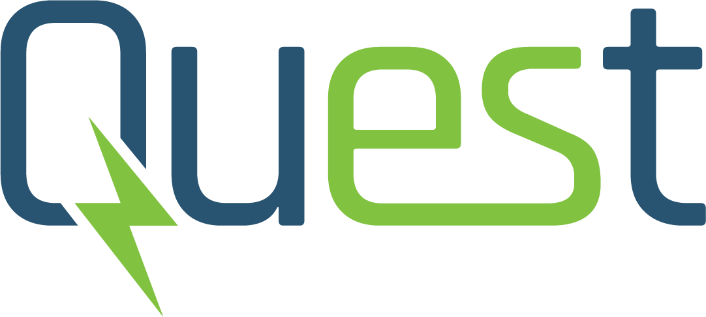

# QuESt: Open-source Platform for Energy Storage Analytics

**Version:** 2.1  
**Release Date:** August 2025  

---

## Overview
QuESt is an open-source Python platform for energy storage analytics. It evolves beyond a single tool into a modular ecosystem that integrates multiple applications, workflows, and AI-powered analytics.

The platform consists of three core components:
- App Hub – install and manage analytics tools  
- Workspace – build workflows across tools  
- QuESt GPT – AI-powered data insights  

---

## Installation

There are two ways to install QuESt:

1. Quick Install (Recommended for most users)  
2. Developer Install (for customization and development)  

---

# 1. Quick Installation (Recommended)

## Windows
1. Go to the GitHub repository:  
   https://github.com/sandialabs/snl-quest  

2. Click “Releases” (right side)

3. Download:
   quest_win.zip

4. Extract the ZIP file

5. Double-click:
   start.bat

This will automatically install dependencies and launch QuESt.

---

## Linux / macOS

### Step 1 — Download
Download ZIP from GitHub

### Step 2 — Extract
unzip snl-quest.zip
cd snl-quest

---

### Step 3 — Install Prerequisites

Install Python (3.9 recommended): https://www.python.org/  
Verify:
python3 --version

Install Git: https://git-scm.com/

---

### Step 4 — Create Virtual Environment
python3 -m pip install virtualenv
python3 -m virtualenv env
source env/bin/activate

---

### Step 5 — Install QuESt
pip install .

---

### Step 6 — Run QuESt
python3 -m quest

---

# 2. Developer Installation

## Step 1 — Prerequisites
- Python 3.9.x  
- Git  

---

## Step 2 — Clone Repository
git clone https://github.com/sandialabs/snl-quest.git
cd snl-quest

---

## Step 3 — Create Virtual Environment
python -m venv env

Activate:

Windows:
.\env\Scripts\activate

Linux/macOS:
source env/bin/activate

---

## Step 4 — Install in Environment
pip install .

---

## Step 5 — Run QuESt
python -m quest

or:
quest

---

## Deactivate Environment
deactivate

---

# Key Features

## App Hub
- Install energy storage tools  
- Each app runs in an isolated environment  
- Multiple apps can run simultaneously  

## Workspace
- Build workflows using nodes and pipelines  
- Combine multiple tools into one process  

## QuESt GPT
- AI-powered data analysis  
- Ask questions directly about datasets  

---

# Contact & Feedback

Use GitHub Issues for bugs and discussions  
Maintainer: Tu Nguyen (@sandia.gov)
