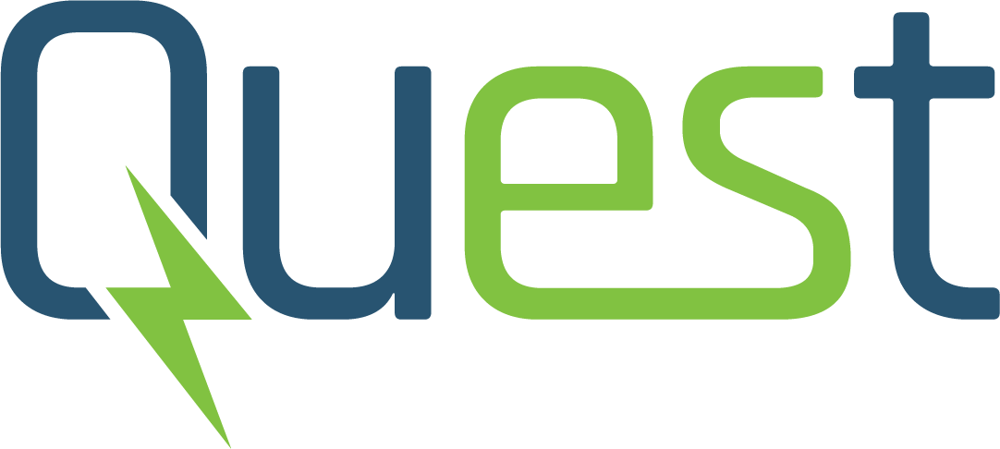
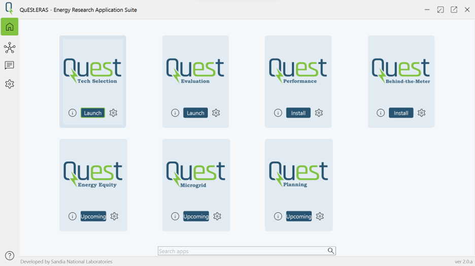

# QuESt: Open-source Platform for Energy Storage Analytics

Current release version: 3.0

Release date: May, 2026

## Contact
For issues and feedback we would appreciate it if you could use the "Issues" feature of this repository. This helps others join the discussion and helps us keep track of and document issues.

### Email
Project maintainer (Tu Nguyen) `@sandia.gov: tunguy`

## Table of contents
- [Introduction](#what-is-it)
- [What's New](#whats-new-in-30)
- [App Hub](#the-app_hub)
- [Workspace](#the-workspace)
- [QuESt Agent](#quest-agent)
- [Innovations](#what-are-the-key-innovations-of-quest-30)
- [Uniqueness](#how-is-quest-30-different-from-the-other-tools-in-energy-storage-analytics)
- [Advantages](#key-competitive-advantages-of-quest-30)
- [Installation](#how-to-download-quest)
- [Contact](#contact)
- [Feedback](#feedback)
- [References](#references)

### What is it?
<a id="what-is-it"></a>
QuESt 3.0 is an evolved version of the original QuESt, an open-source Python software designed for energy storage (ES) analytics. It transforms into a platform providing centralized access to multiple tools and improved data analytics, aiming to simplify ES analysis and democratize access to these tools.



Currently, QuESt 3.0 includes three main components:

### What's new in 3.0
<a id="whats-new-in-30"></a>
QuESt 3.0 focuses on two major platform updates: a stronger QuESt Workspace for building executable energy-storage workflows and a more capable QuESt Agent for guiding users through those workflows.

- **QuESt Workspace:** The Workspace has been expanded into a richer workflow-building environment for master flows and subflows. Users can assemble data nodes, Python nodes, notebooks, subflows, and application-specific processing steps into reusable pipelines; manage Python environments and flow inputs; save and reload workflow files; run configured cases; and inspect generated outputs from a single canvas-centered interface.

- **QuESt Agent:** The QuESt Agent now works directly with Workspace context to help users understand, edit, and extend workflows. It can review the active canvas, use pinned messages and attached files as context, identify relevant tools and reusable skills, draft workflow action plans, preview canvas changes before they are applied, and help troubleshoot node outputs or flow-run results.

- **LLM provider support for the agent:** The QuESt Agent supports OpenAI, Anthropic Claude, and local Ollama/Gemma models from the model dropdown. Claude support uses the official Anthropic SDK and the saved `ANTHROPIC_API_KEY`; OpenAI uses `OPENAI_API_KEY`.

### The App Hub
<a id="the-app_hub"></a>
The QuESt App Hub operates similarly to an app store, offering access points to a multitude of applications. Currently, various energy storage analytics tools have been available on QuESt App hub. For example:

- **QuESt Data Manager** manages the acquisition of data.

- **QuESt Valuation** estimates the potential revenue generated by energy storage systems when providing ancillary services in the electricity markets.

- **QuESt BTM (Behind-The-Meter)** calculates the cost savings for time-of-use and net energy metering customers utilizing behind-the-meter energy storage systems.

- **QuESt Technology Selection** supports in selecting the appropriate energy storage technology based on specific applications and requirements.

- **QuESt Performance** evaluates the performance of energy storage systems in different climatic conditions.

- **QuESt Microgrid** supports microgrid design and simulation considering energy storage as a key component.

- **QuESt Planning** is a long-term capacity expansion planning model that identifies cost-optimal energy storage, generation, and transmission investments and evaluates a broad range of energy storage technologies.

- **Progress** is a Python-based open-source tool for assessing the resource adequacy of the evolving electric power grid integrated with energy storage systems.

It has been designed with key features to improve user experience and application management:

- **User-Friendly Access:** Users can easily find and install applications that suit their specific needs.

- **Isolated Environments:** Upon installation, each application creates an isolated environment. This ensures that applications run independently, preventing conflicts, and enhancing stability.

- **Simultaneous Operation:** Multiple applications can be installed and operated simultaneously, allowing users to leverage different tools without interference.

### The Workspace
<a id="the-workspace"></a>
The QuESt Workspace provides an integrated environment where users can create workflows by assembling multiple applications into a coherent process. It enhances the platform's usability and efficiency through several mechanisms:

- **Integration of Applications:** Users can create work processes that integrate multiple apps by assembling pipelines using plugin extensions. This modular approach allows for the flexible composition of analytics workflows tailored to specific needs.

- **Workflow Management:** The workspace supports the selection, assembly, connection, and post-processing of data and tools. This structured approach streamlines the analytics process, from data preparation to visualization, making it easier to manage and understand.

### QuESt Agent
<a id="quest-agent"></a>
QuESt Agent is the AI-assisted workflow companion built into QuESt Workspace. It uses the active canvas, pinned messages, attached files, available QuESt tools, and saved reusable skills to help users understand, build, validate, and refine Workspace flows.

- **Workspace-aware assistance:** The agent can inspect the current flow, summarize data nodes, Python nodes, connections, missing parts, and validation facts, then use that context when answering questions or planning edits.

- **Tool and skill matching:** The agent ranks relevant QuESt tools and saved skills for a request. Tool-specific skills are gated by high-confidence tool matches, while general Workspace skills and workflow templates can be reused when they directly match the task.

- **Reusable workflow templates:** When a saved skill includes a strong matching workflow JSON template, the agent can prefer loading that template before building from scratch, then validate the resulting flow and suggest follow-up fixes only when real gaps remain.

- **Preview-first canvas actions:** Before changing the canvas, the agent proposes an explicit operation plan, such as creating data nodes, updating Python wrappers, connecting ports, loading a matched template, or validating the current flow. Users can apply the next step, review the plan, cancel it, or revise the request.

- **Flexible LLM providers:** The agent supports OpenAI, Anthropic Claude, and local Ollama/Gemma models. Cloud models can provide stronger semantic review and skill reranking, while local models support lower-cost or local-first workflows.

### What are the key innovations of QuESt 3.0?
<a id="what-are-the-key-innovations-of-quest-30"></a>
QuESt 3.0 advances QuESt from a collection of energy-storage applications into a workflow-centered analytics platform. It combines installable domain tools, an executable visual Workspace, and an AI-assisted QuESt Agent so users can move from data, to model setup, to workflow execution, to interpretation inside one environment.

1. **Executable visual workflows:** The QuESt Workspace lets users assemble energy-storage studies as connected flows rather than one-off scripts. Data nodes, Python nodes, notebooks, subflows, application-specific processing steps, inputs, and outputs can be organized on the same canvas, making the logic of a study easier to inspect, rerun, revise, and share.
2. **Agent-assisted workflow development:** The QuESt Agent works with the active Workspace context. It can review the current canvas, reason over pinned notes and attached files, identify relevant tools or reusable skills, suggest workflow actions, preview canvas changes, and help troubleshoot node outputs or flow-run results.
3. **Provider-flexible LLM support:** QuESt Agent supports OpenAI, Anthropic Claude, and local Ollama/Gemma models. Users can choose between cloud-hosted frontier models and local models depending on cost, privacy, availability, and task complexity.
4. **Reusable knowledge and skills:** QuESt 3.0 strengthens support for capturing workflow knowledge as reusable skills and action templates. This helps preserve successful study patterns and makes repeat analyses easier for both new and experienced users.
5. **Integrated app-to-workflow pathway:** The App Hub provides specialized tools such as BTM, Valuation, Performance, Technology Selection, Planning, Progress, Microgrid, and Data Manager, while the Workspace provides the place to connect those capabilities into larger analyses.

### How is QuESt 3.0 different from the other tools in Energy Storage Analytics?
<a id="how-is-quest-30-different-from-the-other-tools-in-energy-storage-analytics"></a>
Many energy-storage tools focus on a single analysis domain, such as valuation, performance modeling, planning, data acquisition, or microgrid simulation. QuESt 3.0 is different because it treats these capabilities as parts of a larger study environment. Users can install domain tools from the App Hub, connect them through the Workspace, and use QuESt Agent to understand and modify the workflow as it evolves.

This makes QuESt 3.0 especially useful for analyses that cross tool boundaries. A study can combine data preparation, technology assumptions, storage sizing, optimization, scenario execution, and result export in one repeatable workflow. Instead of forcing users to move manually between disconnected applications, scripts, and notes, QuESt provides a shared structure for building and revisiting the analysis.

QuESt also remains open-source and Python-based, which makes it inspectable and extensible. Users can see how workflows are assembled, edit generated node code, attach notebooks, and adapt the platform to local research needs.

### Key Competitive Advantages of QuESt 3.0:
<a id="key-competitive-advantages-of-quest-30"></a>

- **Unified energy-storage platform:** QuESt brings multiple energy-storage analytics applications into one platform while still allowing each tool to remain independently installable and maintainable.

- **Workflow-first analysis:** The Workspace gives users a visual, executable representation of a study. This improves transparency, repeatability, and collaboration compared with isolated scripts or single-purpose graphical tools.

- **AI assistance grounded in the active workflow:** QuESt Agent uses Workspace context, attachments, pinned messages, tool metadata, and reusable skills to provide more targeted assistance than a standalone chatbot.

- **Model choice and deployment flexibility:** Users can select OpenAI, Anthropic Claude, or local Ollama/Gemma models, allowing the agent experience to be tuned for performance, privacy, cost, or offline/local workflows.

- **Extensible Python foundation:** Because QuESt is Python-based and open-source, researchers and developers can inspect, customize, and extend workflows, app integrations, node logic, and agent skills.

- **Repeatable study patterns:** Reusable skills, workflow templates, node notebooks, saved flow files, and explicit input cases help teams preserve analysis methods and rerun studies with changed assumptions.

### How to download QuESt?
<a id="how-to-download-quest"></a>
QuESt is currently available on Github at: https://github.com/sandialabs/snl-quest.

### Installation Instructions for QuESt

## 1. Install Python

Install Python 3.13.x from [python.org](https://www.python.org/) and follow the installer instructions for your operating system. On Windows, enable the option to add Python to `PATH` if it is offered.

Confirm Python is available:

```bash
python --version
```

On Linux/macOS, use `python3 --version` if your system uses `python3` as the command name.

## 2. Create a Virtual Environment Using `venv`

From the directory where you want to install or develop QuESt, create and activate a virtual environment:

```bash
python -m venv env
```

Activate it:

```bash
.\env\Scripts\activate
```

On Linux/macOS:

```bash
source env/bin/activate
```

Upgrade `pip`:

```bash
python -m pip install --upgrade pip
```

## 3. Option 1: Install QuESt Without Git

Use this option if you want to download the source as a ZIP file.

1. Go to https://github.com/sandialabs/snl-quest/tree/QuESt_AI_Agent.
2. Click **Code** and choose **Download ZIP**.
3. Extract the ZIP file.
4. Open a terminal in the extracted QuESt directory.
5. Activate the virtual environment from step 2.
6. Install QuESt:

```bash
python -m pip install .
```

## 4. Option 2: Install QuESt With Git

Use this option if you want to clone the repository or contribute changes.

1. Install Git from [git-scm.com](https://git-scm.com/).
2. Clone the repository:

```bash
git clone -b QuESt_AI_Agent --single-branch https://github.com/sandialabs/snl-quest.git
cd snl-quest
```

3. Activate the virtual environment from step 2.
4. Install QuESt:

```bash
python -m pip install .
```

## Running QuESt

With the virtual environment activated, run:

```bash
python -m quest
```

You can also run:

```bash
quest
```

## Deactivating the Virtual Environment

```bash
deactivate
```

### References
<a id="references"></a>
Nguyen, Tu A., David A. Copp, and Raymond H. Byrne. "Stacking Revenue of Energy Storage System from Resilience, T&D Deferral and Arbitrage." 2019 IEEE Power & Energy Society General Meeting (PESGM). IEEE, 2019.

Byrne, Raymond H., Tu A. Nguyen, and Ricky J. Concepcion. "Opportunities for Energy Storage in CAISO." 2018 IEEE Power & Energy Society General Meeting (PESGM). IEEE, 2018.
[Available online](https://www.osti.gov/servlets/purl/1489129).

Byrne, Raymond H., Tu Anh Nguyen, and Ricky James Concepcion. Opportunities for Energy Storage in CAISO. No. SAND2018-5272C. Sandia National Lab.(SNL-NM), Albuquerque, NM (United States), 2018.
[Available online](https://www.osti.gov/servlets/purl/1515132).

Concepcion, Ricky J., Felipe Wilches-Bernal, and Raymond H. Byrne. "Revenue Opportunities for Electric Storage Resources in the Southwest Power Pool Integrated Marketplace." 2018 IEEE Power & Energy Society General Meeting (PESGM). IEEE, 2018.
[Available online](https://www.osti.gov/servlets/purl/1574578).

Wilches-Bernal, Felipe, Ricky J. Concepcion, and Raymond H. Byrne. "Electrical Energy Storage Participation in the NYISO Electricity and Frequency Regulation Markets." 2018 IEEE Power & Energy Society General Meeting (PESGM). IEEE, 2018.

Nguyen, Tu A., and Raymond H. Byrne. "Maximizing the cost-savings for time-of-use and net-metering customers using behind-the-meter energy storage systems." 2017 North American Power Symposium (NAPS). IEEE, 2017.
[Available online](https://www.osti.gov/servlets/purl/1431654).

Nguyen, Tu A., et al. "Maximizing revenue from electrical energy storage in MISO energy & frequency regulation markets." 2017 IEEE Power & Energy Society General Meeting. IEEE, 2017.
[Available online](https://www.osti.gov/servlets/purl/1408956).

Byrne, Raymond H., Ricky J. Concepcion, and César A. Silva-Monroy. "Estimating potential revenue from electrical energy storage in PJM." 2016 IEEE Power and Energy Society General Meeting (PESGM). IEEE, 2016.
[Available online](https://www.osti.gov/servlets/purl/1239334).

Byrne, Raymond H., et al. "The value proposition for energy storage at the Sterling Municipal Light Department." 2017 IEEE Power & Energy Society General Meeting. IEEE, 2017.
[Available online](https://www.osti.gov/servlets/purl/1427423).

Byrne, Raymond H., et al. "Energy management and optimization methods for grid energy storage systems." IEEE Access 6 (2017): 13231-13260.
[Available online](https://ieeexplore.ieee.org/abstract/document/8016321).

Byrne, Raymond H., and César A. Silva-Monroy. "Potential revenue from electrical energy storage in ERCOT: The impact of location and recent trends." 2015 IEEE Power & Energy Society General Meeting. IEEE, 2015.
[Available online](https://www.osti.gov/servlets/purl/1244909).
